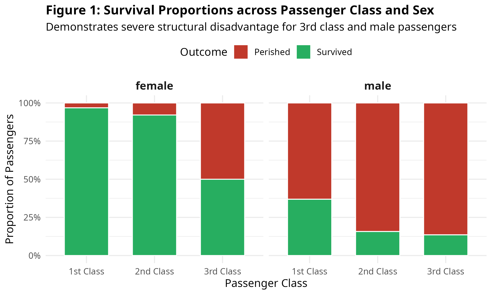
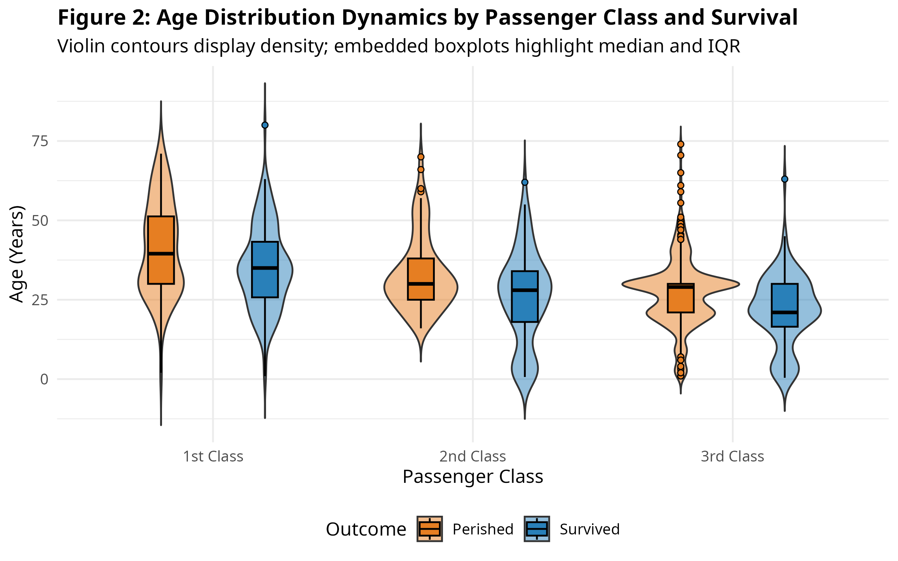
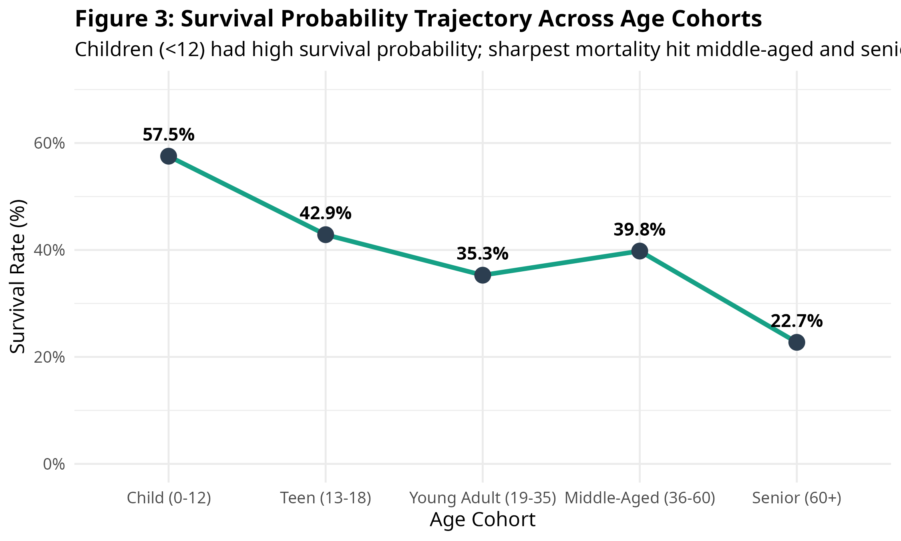
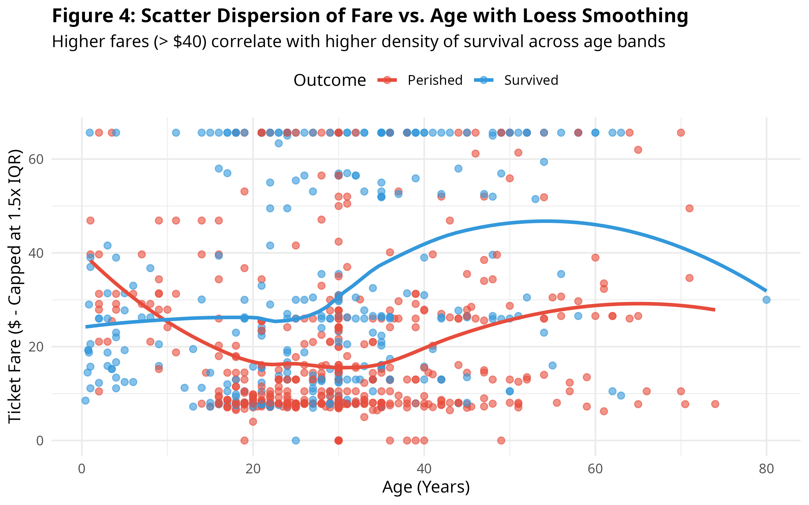
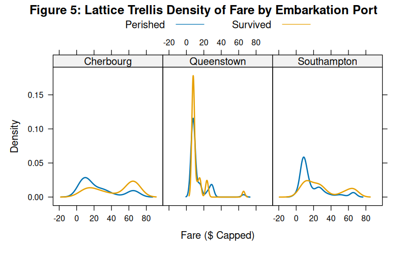

# Titanic Dataset: Visualization and Insight Communication in R

An exploratory data visualization and statistical insight communication pipeline built using R (`ggplot2`, `lattice`, and the `tidyverse` ecosystem).

---

## 📌 Project Overview
This project visualizes multi-dimensional patterns in the extended Titanic passenger manifest (`titanic_train`). It examines how demographic factors (sex, age cohorts), ticket pricing, passenger class, and embarkation points governed survival outcomes during the disaster.

---

## 📊 Visualizations & Key Findings

### 1. Survival Proportions Across Passenger Class and Sex

* **Visualization Type:** 100% Normalized Stacked Bar Chart with Grid Faceting.
* **Key Insight:** Female passengers in 1st and 2nd class experienced survival rates exceeding **85–90%**, whereas 3rd-class female survival dropped to approximately **50%**. Male survival fell below **14%** in 3rd class, demonstrating how socio-economic tier modulated the "women and children first" evacuation protocol.

---

### 2. Age Distribution Dynamics Across Class and Outcome

* **Visualization Type:** Hybrid Density Violin and Tukey Boxplot.
* **Key Insight:** A distinct bimodal bulge is visible among 2nd and 3rd-class survivors in the 0–10 age bracket, confirming prioritized rescue of young children even in lower accommodations. 1st-class passengers exhibited an older median age profile (~38 years).

---

### 3. Survival Probability Trajectory Across Age Cohorts

* **Visualization Type:** Aggregated Point-and-Line Trend Chart.
* **Key Insight:** Children aged 0–12 achieved the highest survival probability (**~57.9%**). Survival dropped sharply into young adulthood (19–35) and stabilized near **36–39%**, reaching its lowest point among seniors (60+) at **~22.7%**.

---

### 4. Continuous Dispersion: Fare vs. Age with Loess Smoothing

* **Visualization Type:** Bivariate Scatter Plot with Local Polynomial Regression (Loess).
* **Key Insight:** The Loess regression trendline for survivors consistently sits above the fatality curve across all age cohorts, indicating that higher fare accommodation was a persistent advantage regardless of age.

---

### 5. Multi-Panel Trellis Density by Port of Embarkation

* **Visualization Type:** Multi-panel conditioning plot using R's `lattice` system.
* **Key Insight:** Cherbourg boarding manifests exhibit an extended long-tail distribution of high-fare tickets, explaining the higher relative survival rate for passengers embarking from France compared to Queenstown, which was predominantly lower-fare emigrants.

---

## 🛠️ Technology Stack
* **Language:** R (v4.x)
* **Visualization Libraries:** `ggplot2`, `lattice`, `scales`, `gridExtra`, `viridis`
* **Data Wrangling:** `tidyverse` (`dplyr`, `tidyr`, `stringr`)
* **Environment:** Posit Cloud / RStudio

---

## 🚀 How to Run Locally / in Posit Cloud
```r
# 1. Clone repository
git clone [https://github.com/rcsriram2007-max/titanic-data-visualization-insights-r.git](https://github.com/rcsriram2007-max/titanic-data-visualization-insights-r.git)

# 2. Open project and run the script
source("scripts/week2_visualizations.R")
